# VLC Skin Studio

A modern editor for VLC skins2 themes: dockable desktop UI, live preview, a
terminal UI, a CLI and an MCP server so AI clients can inspect and build skins
with you. It is a from scratch port of the original VLC Skin Editor (0.8.6)
to Java 25.

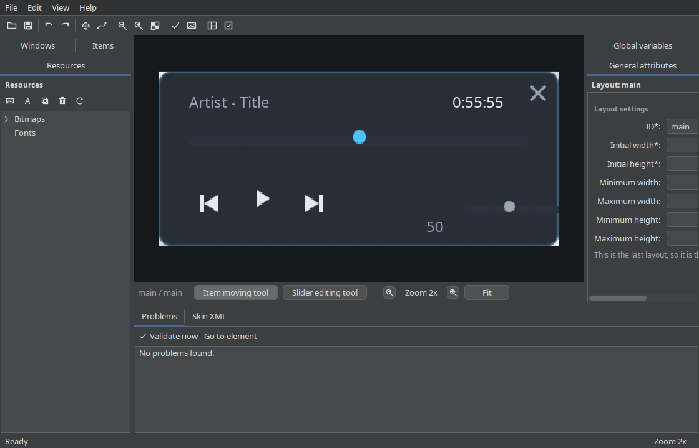

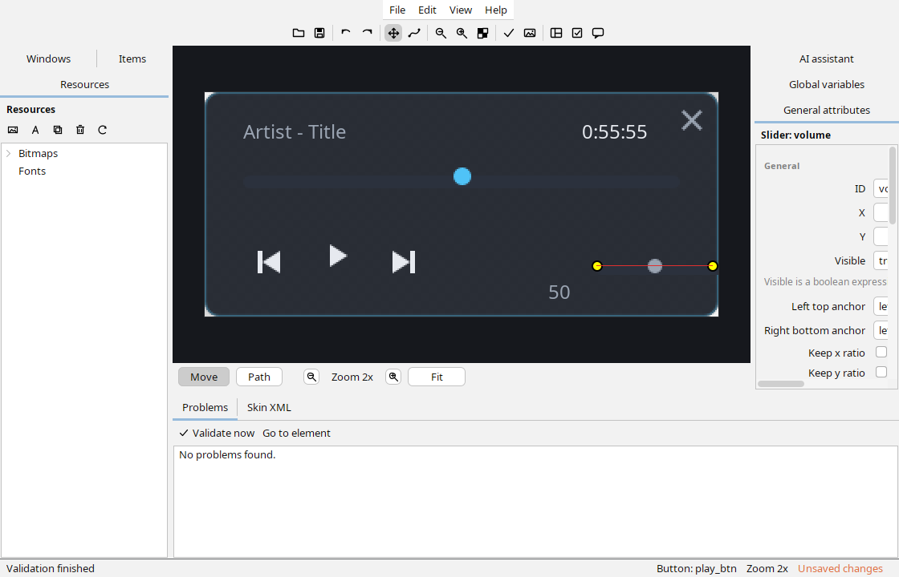

## What it does

* Opens and saves VLC skins2 themes (`.xml`, `.vlt`) with every control skins2
  supports: windows, layouts, anchors, buttons, checkboxes, images, text,
  sliders, slider backgrounds, radial sliders, video areas, playlists,
  playtrees, panels and groups.
* Draws the layout the way VLC does, using VLC's own rules (bezier slider
  paths, slider background frame grids, alphacolor keying, boolean `visible`
  expressions, `$T` and friends). The preview is a real Java2D render, not a
  mockup.
* Keeps everything it does not understand: unknown attributes and elements are
  preserved and written back. A theme from any VLC version opens and saves
  without losing data.
* Animates multi-frame bitmaps in the preview at their fps, like VLC does.
* Drag and drop in the items tree moves controls between groups and panels;
  the canvas drags them with the mouse and every move is undoable.
* Packages and unpacks `.vlt` archives (gzip tar, plus plain zip archives found
  in the wild) with all referenced assets.
* Validates ids, references, sizes, colors and files before VLC has to.
* Browses the official VideoLAN skins gallery and imports a theme in one click,
  preview included, under File > Browse themes; the same is available over MCP.
* Speaks the original editor's language files: 21 translations converted from
  the original VLC Skin Editor bundles cover menus, toolbar, panel titles and
  the common dialogs, and new surfaces fall back to English until translated.
* Gives an AI the same controls through MCP: `layout_tree` describes geometry
  as data for models without vision, `render_layout` returns a PNG and the same
  data for models with vision, and the editing tools change the open document
  with undo.

## Requirements

* Java 25. The build asks Gradle for a Java 25 toolchain.
* VLC only if you want the "Test skin in VLC" menu item.

## Build and run

```bash
./gradlew build                    # compile, test, build the fat jar
java -jar build/libs/vlc-skin-studio.jar          # desktop UI
java -jar build/libs/vlc-skin-studio.jar --help   # CLI
./run.sh                           # the same, builds on first run
```

The desktop window opens with the welcome card: create a skin, open one, or
generate the built in example with real assets. Panels are dockable; drag them
anywhere, float them, or restore the layout on the next start.

Inside the theme there is a generated example that looks like this:


## Desktop UI


The same window in the light theme:


### Editing, in motion

Dragging the play button on the canvas, one undo step:

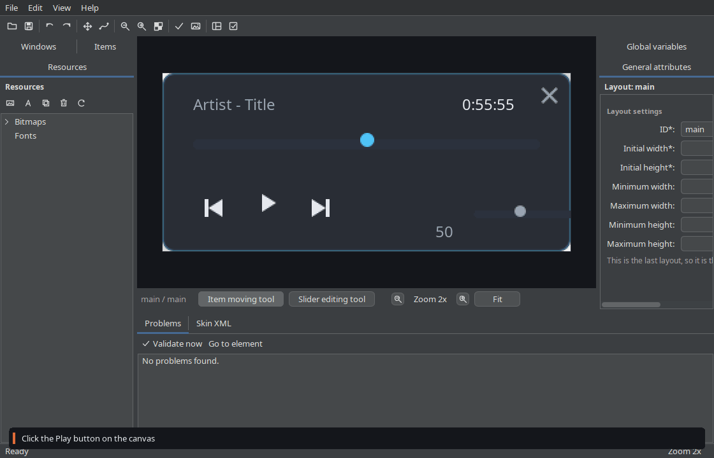

Editing a slider's bezier path with the path tool:

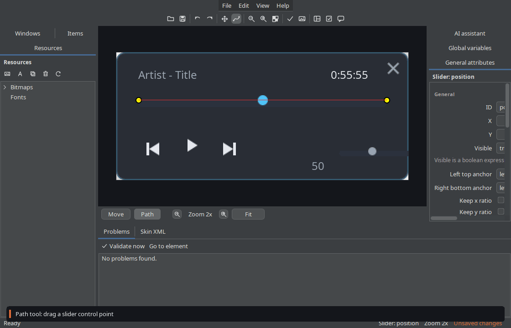

Simulating the player state and watching the preview follow:

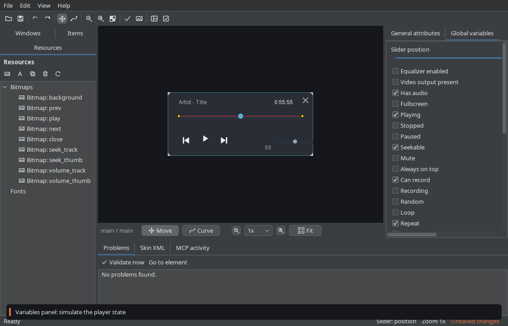

Canvas zoom, themes and a full tour:

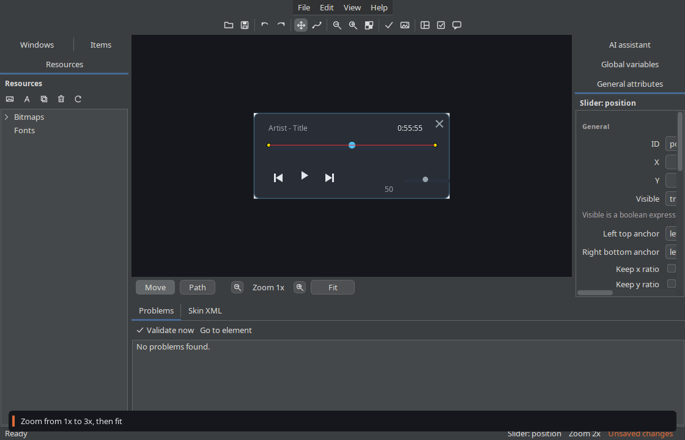

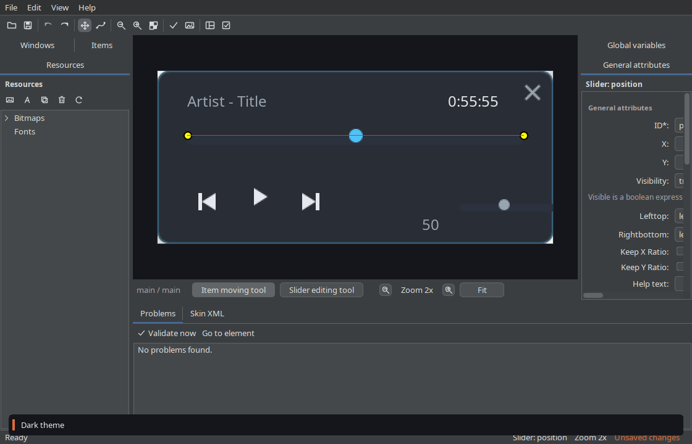

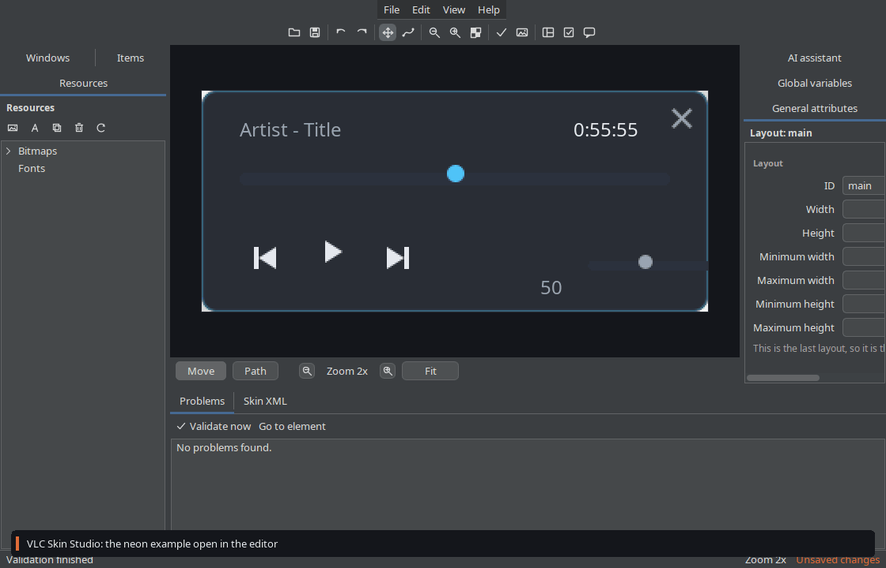

A contact sheet of every frame in the tour lives beside these files as
`full-tour-frames.png`. All of these are generated by the headless test
harness with real mouse events, not mockups; regenerate them with
`./gradlew uiScreenshots`.

### Real skins

The renderer is checked against real themes. The VeLoCity theme (MIT, by
dmtiir) imports through the VLT codec, validates clean and renders like this:

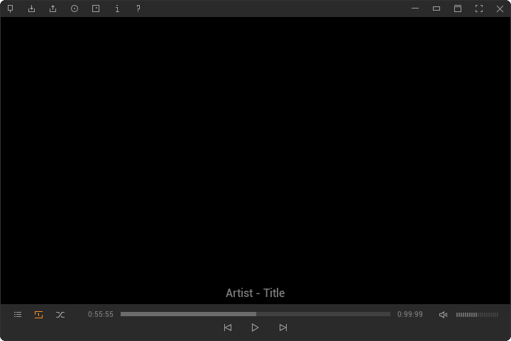

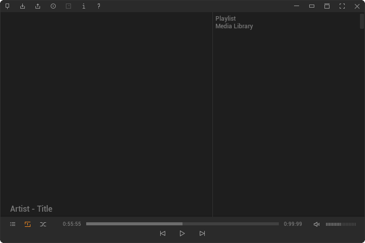

The VeLoCity player window rebuilt from its own sprite sheets by an external
MCP client, one tool call per element:

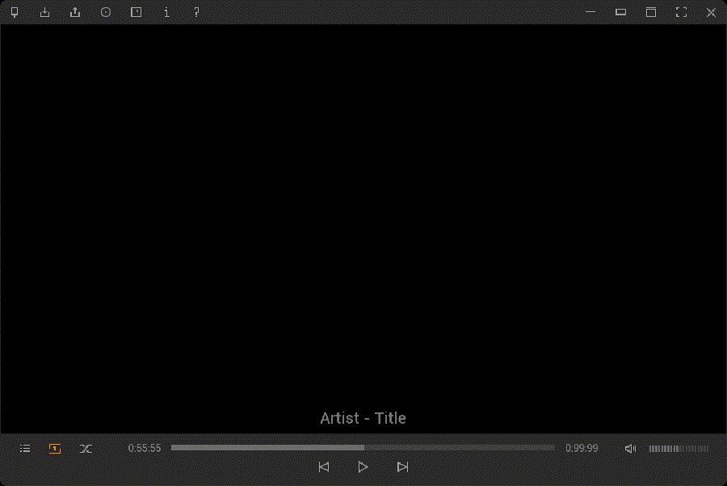

The script that does it is `tools/recreate-velocity-via-mcp.py`; the conformance
sweep over every theme in the official VideoLAN gallery pack is
`tools/gallery-conformance.py`, and its report lives in
`docs/skin-gallery-report.md`.

## Panel reference

| Panel | What it does |
|---|---|
| Resources | bitmaps with sub bitmaps, fonts, bitmap fonts, popup menus, ini files; add bitmap/font, reload images |
| Windows and layouts | windows and their layouts; add, duplicate, delete, reorder |
| Items | the item tree of the active layout; add any control, duplicate, delete, reorder |
| Canvas | the live preview; click to select the topmost item, drag to move, path tool edits slider points, ctrl+wheel zooms |
| Inspector | every attribute of the selected item, resource, window or layout, committed through undo |
| Variables | simulates player state: booleans such as `vlc.isPlaying`, text variables such as `$N`, slider position |
| Problems | validation results; double click jumps to the element |
| Skin XML | the generated XML with syntax highlighting, editable with an Apply step |

Shortcuts: `Ctrl+N` new, `Ctrl+O` open, `Ctrl+S` save, `Ctrl+Z/Y` undo/redo,
`Ctrl+Up/Down/Left/Right` nudge the selected item, `Delete` removes it,
`Ctrl+D` duplicates, `Ctrl+=`/`Ctrl+-`/`Ctrl+0` zoom the canvas.

Themes: Light, Dark, IntelliJ, Darcula, Arc, Arc dark, One dark. The accent is
VLC orange everywhere; both themes are first class.

## CLI

```
vlc-skin-studio <command> [options]

  new        Create a new skin file, empty or from an example
  render     Render a layout to PNG and print or write its geometry
  inspect    Print everything known about a skin as JSON
  validate   Check a skin for errors and warnings
  vlt        Import or export a .vlt theme archive
  tui        Browse and edit a skin in the terminal
  mcp        Run the MCP server over stdio
  examples   List the built in example themes
```

Examples:

```bash
# Start from a generated example with real images.
java -jar vlc-skin-studio.jar new --example neon out/theme.xml

# Validate and render at 2x, with the geometry as JSON.
java -jar vlc-skin-studio.jar validate out/theme.xml
java -jar vlc-skin-studio.jar render out/theme.xml -z 2 -o preview.png --json geometry.json

# Package a theme for VLC.
java -jar vlc-skin-studio.jar vlt export out/theme.xml out/theme.vlt
vlc -I skins2 --skins2-last=out/theme.xml
```

`render` writes a PNG and, with `--json`, a `layout_tree` style description:
every item with id, type, absolute x/y/width/height, z order, visibility, text
and the attributes that matter. A model without image input can reason about
the layout from that alone.

## Terminal UI

```
./run.sh tui out/theme.xml
vlcskin> tree            # geometry as a table
vlcskin> render!         # the preview as truecolor half blocks
vlcskin> set vlc.isPlaying true
vlcskin> show play_btn
vlcskin> validate
```

The TUI is line based on purpose: it works over SSH, in CI logs, and is covered
by tests without a terminal.

## MCP server

The server speaks MCP over stdio and exposes the editor:

* `open_skin`, `new_skin`, `save_skin`, `import_vlt`, `export_vlt`,
  `document_info`, `reset_skin`
* `layout_tree`, `render_layout`, `list_items`, `get_item`, `get_resource`
* `add_item`, `delete_item`, `move_item`, `nudge_item`, `reorder_item`,
  `reparent_item`, `set_item_property`, `duplicate_item`
* `add_resource`, `add_bitmap_from_file`, `add_sub_bitmap`,
  `set_resource_property`, `set_sub_bitmap_property`, `delete_sub_bitmap`,
  `delete_resource`, `duplicate_resource`
* `add_window`, `delete_window`, `add_layout`, `delete_layout`,
  `duplicate_window`, `duplicate_layout`, `reorder_layout`,
  `set_theme_property`, `set_window_property`, `set_layout_property`
* `undo`, `redo`, `history_state`, `select_element`, `get_selection`
* `get_xml`, `apply_xml`, `reload_images`, `save_preview`, `test_in_vlc`
* `generate_slider_background`, `validate_skin`, `set_variables`,
  `get_variables`, `list_actions`, `list_examples`, `create_example`
* `get_preferences`, `set_preferences`, `set_canvas`, `show_panel`,
  `open_settings`, `check_for_updates`
* `list_gallery_themes`, `import_gallery_theme` (the official VideoLAN gallery)
* `describe_editor_ui`, `screenshot_editor` (available when the desktop window
  is running in the same process)

Register it with OpenCode (V2 configuration):

```jsonc
{
  "mcp": {
    "servers": {
      "vlc-skin-studio": {
        "type": "local",
        "command": ["java", "-jar", "/absolute/path/vlc-skin-studio.jar", "mcp"]
      }
    }
  }
}
```

Or with the CLI: `opencode mcp add vlc-skin-studio --global -- java -jar /path/vlc-skin-studio.jar mcp`.

Start it with a skin already open if you like:
`java -jar vlc-skin-studio.jar mcp --file out/theme.xml`.

A typical AI session: create an example, ask for the geometry, change a few
attributes, ask for a render and look at it. The server returns the PNG as
image content and the geometry as structured data in the same reply.

## Native image (optional)

GraalVM 25 can build a self-contained binary for the CLI, TUI and MCP entry
points, PNG rendering included. The desktop Swing window stays on the JVM: the
binary prints that pointer when started without a subcommand.

```bash
sdk install java 25.4.4.1+1-graalce
tools/build-native.sh
build/native/vlc-skin-studio --version
build/native/vlc-skin-studio render skin.xml -o preview.png
build/native/vlc-skin-studio mcp
```

Java2D inside the image has no font configuration of its own, so the build
writes `fontconfig.properties` next to the binary with the DejaVu families it
found; `VlcSkinStudio` points `sun.awt.fontconfig` at it. Keep that file and
the `.so` files that native-image places next to the executable.

The binary is about 68 MB. `picocli-codegen` runs at compile time for the CLI
metadata, and the AWT reflection and JNI entries collected with GraalVM's
tracing agent live under `src/main/resources/META-INF/native-image/`.

## Automation and MCP

Scripts, editors and AI clients drive the same `EditorService` over the MCP
server, so every operation the window can do is reproducible from a terminal.

## Format support

Everything the DTD and the original editor support, plus the parts the original
dropped:

* Theme, ThemeInfo, Window, Layout, Include, IniFile
* Bitmap, SubBitmap, Font, BitmapFont
* PopupMenu with MenuItem and MenuSeparator
* Anchor, Button, Checkbox, Group, Image, Panel, Playlist, Playtree,
  RadialSlider, Slider, SliderBackground, Text, Video

The editor writes canonical attribute order and omits defaults. Unknown
attributes and elements are kept verbatim. See `AGENTS.md` for the exact
behavior of defaults, ids, bezier paths, alpha keying and expressions.

## Examples

Two examples are generated on demand with real PNG assets drawn by the tool
itself: `neon` (a 320x140 player bar) and `panel` (a 420x220 video panel with
a playlist area). They exist to give new users something that renders on the
first run and to give tests a realistic theme.

## Architecture

```
src/main/java/dev/zoroaster1x/vlcskin/
  model, format, render, edit, action, describe, snapshot, mcp, ai,
  cli, tui, example, util
        format, renderer, edit commands, MCP server, AI client, CLI, TUI,
        examples. No Swing.
  app   Swing UI on FlatLaf and ModernDocking, panels, dialogs, inspector,
        headless UI harness, MCP UI bridge.
```

The format, render and tooling packages are UI free, so the CLI, TUI and MCP
server run without a display. The app adds the desktop window and never reaches
into model internals directly: every change goes through `EditorService` or an
undoable `ValueCommand`.

## Tests

```bash
./gradlew build
```

71 tests across 15 suites cover round trips, escaping, unknown content, bezier
maths, boolean expressions, rendering, hit testing, bitmap animation, slider
backgrounds, VLT archives (including a zip that bundles further themes), the
editor service, the MCP control surface, the theme gallery parser and cache,
the settings store, the converted translations and the examples. The UI suite
builds the whole panel tree offscreen, paints it in both themes, dispatches
real mouse events to move an item and undo it, and writes screenshots to
`build/reports/screenshots/`.

Against real skins: the VeLoCity theme imports through the VLT codec and
validates clean, and `tools/gallery-conformance.py` sweeps every theme in the
official VideoLAN pack plus the two themes VLC itself ships. The latest run
imported, validated and rendered all 123 themes; the numbers, the per theme
table and the classification of the validation messages old themes carry are
in `docs/skin-gallery-report.md`. The feature by feature comparison with the
original editor, including the remaining differences, is in
`docs/feature-parity.md`.

## Known limits

* Localization covers the original editor's surfaces (menus, toolbar, panel
  titles, common dialogs). The newer panels stay English until a translation
  exists; the bundle mechanism is in place, and translations can be dropped
  into the config `lang` folder without rebuilding.
* The update check opens the GitHub releases page and can compare the latest
  release tag on startup; there is no self-updater, because releases are cut
  and attested by CI.
* VLT import and export show a progress dialog but no byte level progress bar.
* Real chart parts, video playback and tooltips are VLC runtime behavior and
  are not simulated beyond the black video rectangle.
* The preview renders fonts with the JVM's font stack; a skin that depends on
  hinting differences may look a pixel or two off from VLC on another platform.
* The toolbar is docked at the top; unlike the original it is not a floating
  palette, since floating panels already cover that need.
* The GraalVM native image covers the CLI, TUI, MCP server and PNG rendering;
  the desktop window runs on the JVM and the binary prints a pointer when it is
  started without a subcommand. The image needs the `.so` files and the
  generated `fontconfig.properties` next to the executable.

## License

GPL-3.0-or-later. This is a derivative of the original VLC Skin Editor by
Daniel Dreibrodt (GPL-2.0-or-later) and reads the VLC skins2 format, whose
implementation in VLC is GPL-2.0-or-later. See `LICENSE`.

## Credits

* The original VLC Skin Editor 0.8.6 by Daniel Dreibrodt, the reference for
  every dialog and for the generated XML.
* The VLC team for skins2 and its parser, the source of truth for rendering
  and format behavior.
* FlatLaf, ModernDocking, RSyntaxTextArea, MigLayout, Jackson, picocli, JLine,
  Apache Commons Compress and the official MCP Java SDK.

## Funding

If this saves you time, consider supporting development. Every contribution
goes toward maintenance and the long tail of skin edge cases.

**Monero (XMR):**

```
8BdxmQSniku4dBJXWPXeXvgjztmj5nmvWQqeCrVvCtYciusbAyo4rqrGCefTfQ4gGaVZmLN7VgLiYUYyBdYFEwHn1UWPjWs
```

Crypto is not your thing? Starring the repository, filing clear bug reports
with a sample skin, and telling other skinners all help just as much.
